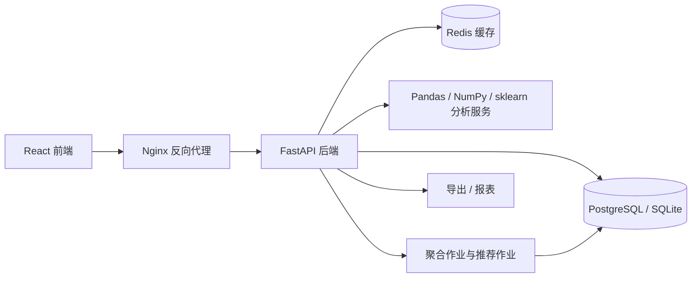
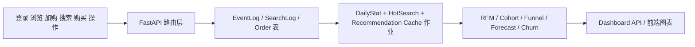
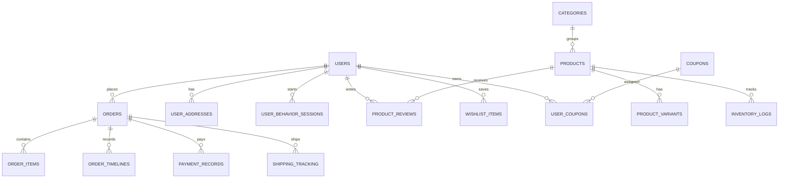

# 系统设计

## 架构图

## 大数据流转

## ER 图

## API 设计重点

| 模块 | 示例接口 |
| --- | --- |
| 认证 | `/auth/register`、`/auth/login`、`/auth/password-reset` |
| 商品 | `/products`、`/products/{id}`、`/products/{id}/reviews`、`/products/categories` |
| 订单 | `/orders/checkout`、`/orders/history` |
| 分析 | `/analytics/dashboard`、`/analytics/rfm`、`/analytics/cohorts`、`/analytics/funnel` |
| 推荐 | `/api/recommendations/personalized`、`/api/recommendations/trending` |
| 管理 | `/admin/sales-accounts`、`/analytics/jobs/daily-stats` |

## 关键设计决策

- 为适配 SQLite 本地开发，采用增量式模式演进与轻量列迁移策略
- 在正式部署流量到来前，通过高质量仿真数据模拟业务行为
- 分析结果主要基于交易表与事件表计算，保证可追溯性
- 设置推荐缓存表，模拟夜间离线预计算过程

## 风险矩阵

| 风险 | 概率 | 影响 | 缓解措施 |
| --- | --- | --- | --- |
| 范围失控 | 高 | 高 | 分阶段交付：先后端域模型，再前端，再文档 |
| 部署失败 | 中 | 高 | 提供 Docker Compose 基线与阿里云部署清单 |
| 数据不一致 | 中 | 高 | 订单事务写入、审计日志、聚合刷新作业 |
| 性能瓶颈 | 中 | 中 | 日统计缓存、推荐缓存、支持分页的接口 |
| 安全漏洞 | 中 | 高 | JWT 鉴权、角色守卫、ORM、防可疑行为日志 |
