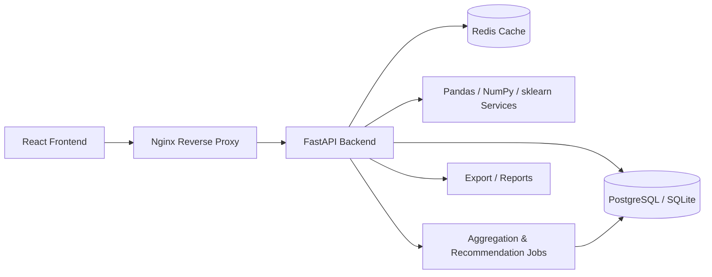
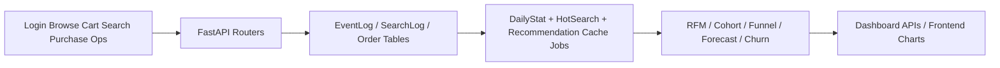
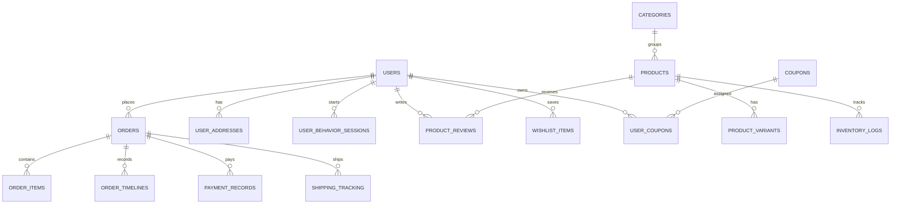

# System Design

## Architecture Diagram

## Big Data Flow

## ER Diagram

## API Design Highlights

| Module | Example Endpoints |
| --- | --- |
| Auth | `/auth/register`, `/auth/login`, `/auth/password-reset` |
| Products | `/products`, `/products/{id}`, `/products/{id}/reviews`, `/products/categories` |
| Orders | `/orders/checkout`, `/orders/history` |
| Analytics | `/analytics/dashboard`, `/analytics/rfm`, `/analytics/cohorts`, `/analytics/funnel` |
| Recommendations | `/api/recommendations/personalized`, `/api/recommendations/trending` |
| Admin | `/admin/sales-accounts`, `/analytics/jobs/daily-stats` |

## Key Design Decisions

- Additive schema evolution for SQLite local development using lightweight column migrations
- Rich synthetic data to emulate business behavior before real deployment traffic exists
- Analytics computed primarily from transactional and event tables to preserve traceability
- Recommendation cache table to simulate nightly offline computation

## Risk Matrix

| Risk | Probability | Impact | Mitigation |
| --- | --- | --- | --- |
| Scope creep | High | High | Stage delivery: backend domain first, UI second, docs third |
| Deployment failure | Medium | High | Docker Compose baseline and Aliyun deployment checklist |
| Data inconsistency | Medium | High | Transactional order writes, audit logs, aggregation refresh jobs |
| Performance bottleneck | Medium | Medium | Daily stats cache, recommendation cache, pagination-ready APIs |
| Security vulnerability | Medium | High | JWT auth, role guards, ORM usage, suspicious activity logging |
